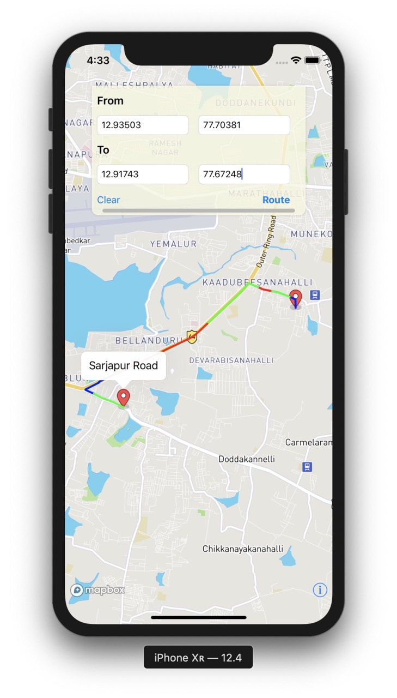

# Locus-iManifest
Bootstrap Paradox Hackathon - Locus.sh - Travel Time Prediction

## Instruction to Compile and run application using Xcode
* clone this repository
* run pod install (from terminal)
* open the .xcodeworkspace (not .xcodeproject)

Ensure the backend is up and running before launching the App. 
The path of backend API is: http://167.71.110.120/routes

The screenshot of the App is:

